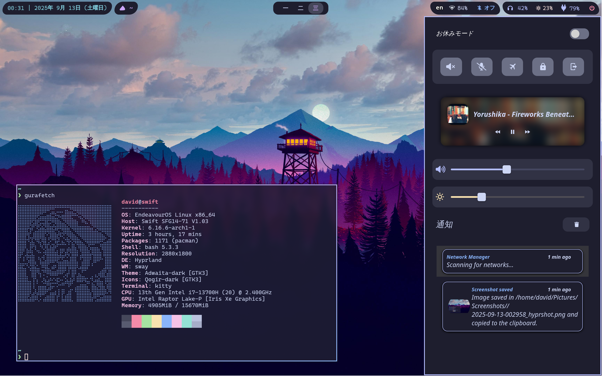
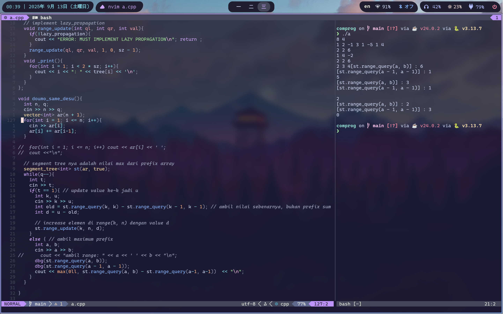
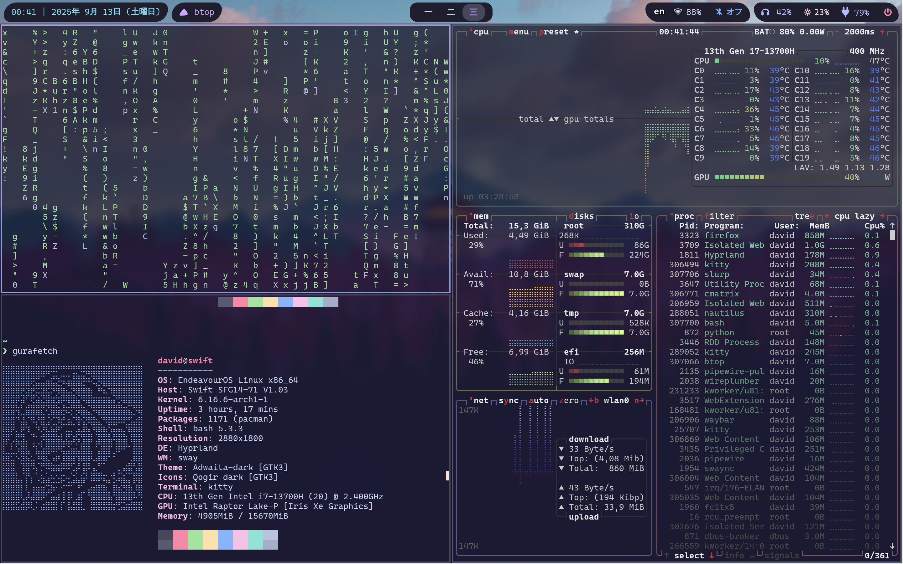
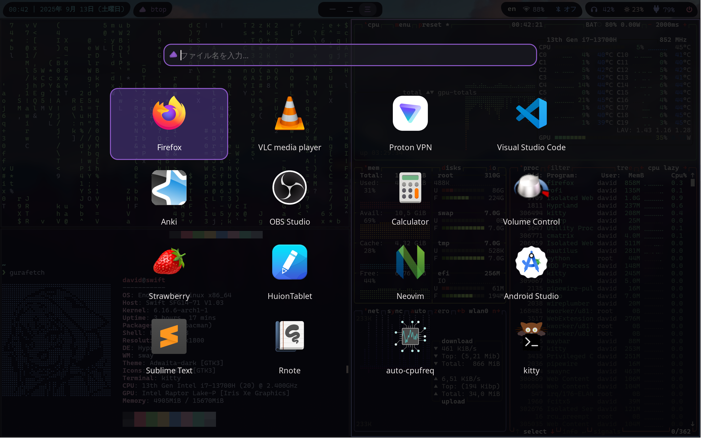

# hyprland dotfiles config
https://github.com/user-attachments/assets/9a1fc7c2-45cd-4f00-810a-2a0fd4bffee0

## dependencies list
- window tiling manager: hyprland 
- status bar: waybar
- app launcher: rofi
- lockscreen: hyprlock 
- idle management: hypridle
- wallpaper: swww (for gif) or hyprpaper (for static)
- fonts: CaskaydiaCove, Nerd, AwesomeFont
- notifications: swaync
- network manager: nm-applet
- bluetooth manager: blueman-manager
- file search: fd
- logout menu: wlogout
- color theme (optional): Catppuccin Mocha
- XDG Desktop Portal: xdg-desktop-portal, xdg-desktop-portal-hyprland, xdg-desktop-portal-gtk

Works on EndeavourOS (Arch Linux based)

## configuration structure
```
hypr-config/
├── .config/
│   ├── hypr/              # Hyprland configuration
│   └── xdg-desktop-portal/ # Portal config for screensharing/screenshot
│       └── portals.conf    # Auto-switching between Hyprland & GNOME portals
└── ...
```

**Note:** `~/.config/xdg-desktop-portal/portals.conf` is a symlink to the file in this repo.

## some screenshots :)








